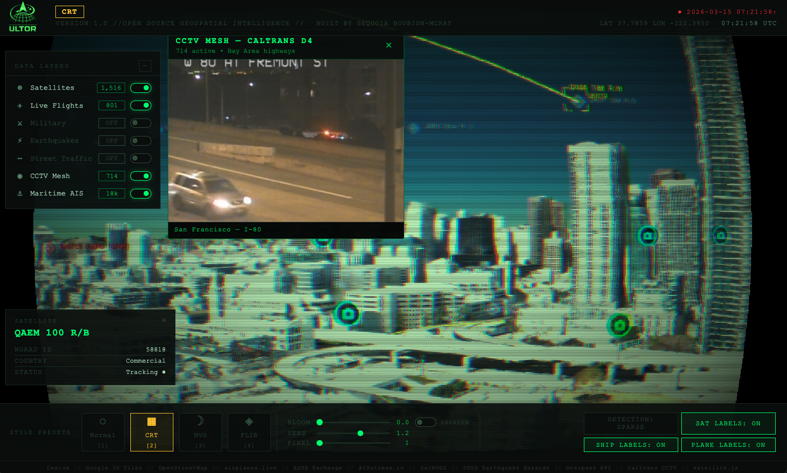

# ULTOR: Real-Time Geospatial Intelligence

> Real-time geospatial intelligence on a photorealistic 3D globe. Satellites, ships, aircraft, seismic events, and more, unified in a single desktop interface.

**Version 1.0** · Built by Sequoia Boubion-McKay · [LinkedIn](https://www.linkedin.com/in/sequoiabm)



---

## Get Running in 5 Minutes

```bash
# 1. Clone and install
git clone https://github.com/Sequoiabm/ULTOR
cd ultor
npm install

# 2. Configure API keys
cp .env.example .env
# Open .env and set VITE_GOOGLE_MAPS_KEY (required for 3D tiles)
# VITE_AISSTREAM_KEY is optional — enables live ship tracking

# 3. Launch
npm run dev
```

That's it. A 3D globe opens with satellites, flights, seismic data, and traffic active by default. Toggle additional layers from the left panel. See [Environment Variables](#environment-variables) for optional data sources.

---

## What is Ultor?

Ultor is an open-source desktop geospatial intelligence platform built on CesiumJS and Electron. It pulls live data from a dozen public and semi-public sources and renders everything together on a photorealistic globe, giving you a unified, real-time picture of what's moving in the world at any given moment.

It's designed as a **platform**, not a product. The layer system is intentionally modular so you can drop in your own data sources, build custom overlays, and extend it for your own use case without touching the core.

---

## Tech Stack

| Component | Technology |
|-----------|------------|
| **Build** | Vite 8 |
| **3D Globe** | CesiumJS 1.139 |
| **Desktop** | Electron 41 |
| **Base Map** | OpenStreetMap + Google Photorealistic 3D Tiles |
| **Orbit Propagation** | satellite.js (SGP4) |

---

## Data Sources

| Layer | Source | API Key Required |
|-------|--------|------------------|
| Satellites | SatNOGS TLE DB | No |
| Commercial Flights | airplanes.live | No |
| Military Flights | airplanes.live / ADSB Exchange | Optional (VITE_ADSB_KEY) |
| Maritime AIS | aisstream.io via Electron proxy | Yes (VITE_AISSTREAM_KEY) |
| Earthquakes | USGS GeoJSON feed | No |
| Street Traffic | Overpass API (OSM roads) | No |
| CCTV | Caltrans D4 CWWP2 | No |

---

## Getting Started

### Prerequisites

- Node.js 18+
- npm or pnpm

<a name="environment-variables"></a>
### Environment Variables

Copy `.env.example` to `.env` and configure:

```bash
# Required for Google 3D Tiles (photorealistic globe)
VITE_GOOGLE_MAPS_KEY=your_google_maps_api_key

# Optional — Cesium Ion (blank suppresses default warning)
VITE_CESIUM_TOKEN=

# Optional — Military flight data (ADSB Exchange via RapidAPI)
VITE_ADSB_KEY=

# Optional — Maritime AIS (aisstream.io) — required for ship tracking
VITE_AISSTREAM_KEY=
```

### Run Development

```bash
npm install
npm run dev
```

Opens Electron window with Vite dev server at `http://localhost:5173`.

### Build for Production

```bash
npm run build
```

Produces `dist/` (web assets) and `dist-electron/` (Electron main process). Use `electron-builder` for packaged app (DMG on macOS).

**Maritime AIS in packaged app:** The `.env` file is not bundled. For ship tracking to work, copy your `.env` to:
- **macOS:** `~/Library/Application Support/ultor/.env`

---

## Project Structure

```
ULTOR/
├── electron/
│   ├── main.js       # Electron main process, AIS proxy
│   └── preload.js    # Context bridge for renderer
├── src/
│   ├── main.js       # App entry, globe init, layer registration
│   ├── globe.js      # Cesium viewer setup, 3D tiles, imagery
│   ├── layerManager.js # Layer lifecycle (register, toggle, enable, disable)
│   ├── hud.js        # Head-up display (panels, toggles, info panel)
│   ├── detectMode.js # Sparse vs Full detection density
│   └── layers/
│       ├── README.md       # Layer interface contract
│       ├── shaderMode.js   # Visual presets: Normal, CRT, NVG, FLIR
│       ├── satellites.js   # TLE propagation, country classification
│       ├── flights.js     # Commercial flights (airplanes.live)
│       ├── military.js    # Military aircraft (ADSB/airplanes.live)
│       ├── maritime.js    # AIS ship tracking
│       ├── seismic.js     # USGS earthquakes
│       ├── traffic.js     # OSM road particle system
│       └── cameras.js     # Caltrans CCTV feeds
├── index.html
├── vite.config.js
└── package.json
```

---

## Security Notes

Ultor uses several Electron settings that would be inappropriate in a public-facing web app but are intentional here because this is a local desktop application run only by its owner.

**`webSecurity: false`**
CesiumJS loads map tiles and data directly in the renderer from Google CDN, OpenStreetMap, USGS, and other cross-origin sources. Without this flag, CORS blocks most of those requests. In a desktop app there is no cross-site attack surface, so relaxing web security is the standard approach for Cesium-based Electron apps.

**`unsafe-eval` / `unsafe-inline` in CSP**
CesiumJS uses `eval()` internally during WebGL shader compilation. Without `unsafe-eval` the globe will not render. `unsafe-inline` is required for dynamic styles. Both are accepted trade-offs in this context.

**`ignore-certificate-errors`**
Prevents fetch failures on the local AIS proxy (`127.0.0.1:17853`) and on tile requests that may encounter certificate issues. The realistic risk in a local desktop tool is low: a network-level MITM attack could spoof tile imagery, but not execute code or exfiltrate data. Acceptable for a single-owner intelligence workstation; would not be acceptable in a shared or networked environment.

None of these flags are oversights. They are required for the app to function correctly and are standard practice for local Electron applications that interface with external tile and data APIs.

---

## Layer Module Interface

Every layer implements this contract (see `src/layers/README.md`):

```js
{
  id: string,        // Unique key (e.g. 'satellites')
  label: string,     // HUD display name
  enabled: boolean,  // Default on/off
  init(viewer) {},   // One-time setup
  enable(viewer) {}, // Show / start polling
  disable(viewer) {},// Hide / stop / cleanup
  refresh() {},      // Optional: called on poll tick
}
```

---

## Custom Events (ea:*)

The app uses `window.dispatchEvent` for cross-module communication:

| Event | Detail | Purpose |
|-------|--------|---------|
| `ea:satellite-selected` | `{ name, noradId, country }` | HUD info panel |
| `ea:flight-selected` | `{ icao24, callsign, altitude, velocity }` | HUD info panel |
| `ea:military-selected` | `{ icao, callsign, type, altitude, speed_kt }` | HUD info panel |
| `ea:ship-selected` | `{ mmsi, name, type, lat, lon, speed, heading }` | HUD info panel |
| `ea:modeChange` | `{ mode, label }` | Shader preset change (1–4) |
| `ea:detectPre` | n/a | Before Sparse/Full switch (fade out) |
| `ea:detectChange` | `{ full }` | After Sparse/Full switch |

---

## Keyboard Shortcuts

| Key | Action |
|-----|--------|
| 1 | Normal visual mode |
| 2 | CRT mode |
| 3 | NVG (night vision) mode |
| 4 | FLIR thermal mode |

---

## License

Open source. See LICENSE for details.
